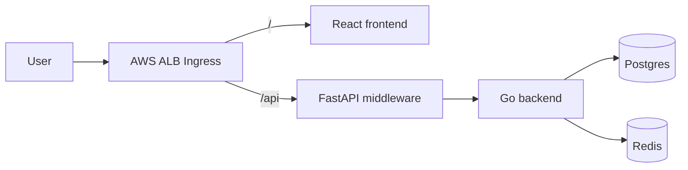

# argoCD-k8s-demo

A production-shaped, GitOps-deployed e-commerce app on AWS EKS: React frontend, FastAPI middleware/gateway,
Go backend (catalog/cart/reviews/checkout/payment), Postgres + Redis, monitored with Prometheus/Grafana,
deployed via a Helm chart that Argo CD continuously reconciles.

## Architecture

```mermaid
flowchart LR
    A[git push to services/**] --> B[GitHub Actions: build + push image via OIDC]
    B -->|tag = git sha| C[(ECR x3 repos)]
    C -->|polls for new tag| D[Argo CD Image Updater]
    D -->|commits new tag to values.yaml| E[(this Git repo)]
    E -->|detects new commit| F[Argo CD: ecom Application]
    F -->|helm upgrade, prune + selfHeal| G[EKS: ecom namespace]
```





## Why This Design

| Domain | Pattern | Data strategy |
|---|---|---|
| Catalog (product tiles/detail) | Read-heavy | Postgres source of truth + **Redis cache-aside** (60s TTL, invalidated on write) |
| Cart | Write-heavy, ephemeral | **Redis only** - no durability needed, TTL expires abandoned carts |
| Reviews/Comments | Read *and* write heavy | Postgres writes + cached listing reads, invalidated on new review |
| Checkout/Orders | Write-heavy, must be consistent | Postgres only, transactional - **never cached** |
| Payment | Write-heavy, must be idempotent | Postgres + `Idempotency-Key` dedupe - no card data stored (PCI scope avoidance) |

All 5 domains run as one Go binary (`services/backend`) for now - simpler ops at a 1-2k user scale, and each
domain is already an isolated package if a domain later needs to become its own deployment.

## Tech Stack

| Layer | Tool |
|---|---|
| Frontend | React + Vite + Tailwind (glassmorphism UI) |
| Middleware / API gateway | FastAPI (auth, aggregation, future recommendation/classification model) |
| Backend | Go (stdlib `net/http`, `pgx`, `go-redis`) |
| Datastores | PostgreSQL + Redis (Bitnami Helm charts, as Helm chart dependencies) |
| Infra | Terraform (VPC, EKS, ECR x3, IAM/IRSA) |
| Packaging | Helm (`charts/ecom` umbrella chart) |
| CI | GitHub Actions, OIDC to AWS (no static AWS keys) |
| CD / GitOps | Argo CD + Argo CD Image Updater, App-of-Apps pattern |
| Monitoring | kube-prometheus-stack (Prometheus + Grafana + Alertmanager) |

## Repository Layout

```
infra/                Terraform: VPC, EKS, ECR (3 repos), IAM for LB controller / Image Updater / GitHub Actions OIDC
services/
  frontend/            React + Vite + Tailwind
  middleware/           FastAPI gateway
  backend/              Go modular monolith (catalog, cart, reviews, checkout, payment)
charts/
  ecom/                 Helm umbrella chart (app + Bitnami postgresql/redis dependencies)
argocd/
  root-app.yaml          App-of-Apps root - the one Application you apply by hand
  apps/
    ecom-application.yaml        Deploys charts/ecom, auto-sync + selfHeal + prune
    monitoring-application.yaml  Deploys kube-prometheus-stack
  argocd-server-ingress.yaml     Optional ALB ingress for the Argo CD UI
.github/workflows/build-and-push.yml   CI: builds + pushes each service's image on push to main
```

## Setup

### 1. Infrastructure

```bash
cd infra
cp terraform.tfvars.example terraform.tfvars
# edit terraform.tfvars: restrict cluster_endpoint_public_access_cidrs, confirm github_repo
terraform init
terraform apply
aws eks update-kubeconfig --region "$(terraform output -raw aws_region)" --name "$(terraform output -raw cluster_name)"
```

### 2. AWS Load Balancer Controller

```bash
helm repo add eks https://aws.github.io/eks-charts
helm install aws-load-balancer-controller eks/aws-load-balancer-controller -n kube-system \
  --set clusterName="$(terraform -chdir=infra output -raw cluster_name)" \
  --set region="$(terraform -chdir=infra output -raw aws_region)" \
  --set vpcId="$(terraform -chdir=infra output -raw vpc_id)" \
  --set serviceAccount.create=true --set serviceAccount.name=aws-load-balancer-controller \
  --set serviceAccount.annotations."eks\.amazonaws\.com/role-arn"="$(terraform -chdir=infra output -raw lb_controller_role_arn)"
```

### 3. Argo CD + Image Updater

```bash
kubectl create namespace argocd
kubectl apply -n argocd -f https://raw.githubusercontent.com/argoproj/argo-cd/stable/manifests/install.yaml

helm repo add argo https://argoproj.github.io/argo-helm
helm install argocd-image-updater argo/argocd-image-updater -n argocd \
  --set serviceAccount.annotations."eks\.amazonaws\.com/role-arn"="$(terraform -chdir=infra output -raw argocd_image_updater_role_arn)"
```

### 4. Fill in placeholders, then bootstrap

`repoURL` (already set to `https://github.com/RanjitThakur678/argoCD-k8s-demo.git`) and the ECR account/region
in `argocd/apps/ecom-application.yaml` + `charts/ecom/values.yaml` are pre-filled for account `717292229347` /
`us-east-1` - update both if you deploy `infra/` into a different account or region than that.

```bash
kubectl apply -f argocd/root-app.yaml
```

This one command bootstraps everything else (`ecom` + `monitoring` Applications) - Argo CD takes it from there.

### 5. GitHub Actions

In the repo's Settings -> Secrets and variables -> Actions, add these **repository variables**:
- `AWS_GITHUB_ACTIONS_ROLE_ARN` = `terraform -chdir=infra output -raw github_actions_role_arn`
- `AWS_REGION`, `PROJECT_NAME` (`ecom-app`), `ENVIRONMENT` (`dev`) - must match `infra/terraform.tfvars`.

Push to `main` under `services/**` and the workflow builds/pushes all 3 images - Image Updater then takes new
tags from ECR to Git to cluster with no further manual steps.

### 6. Access

```bash
# Grafana
kubectl -n monitoring port-forward svc/monitoring-grafana 3000:80   # admin / changeme (see monitoring-application.yaml)
# App
kubectl get ingress -n ecom   # ALB hostname
# Argo CD
kubectl -n argocd port-forward svc/argocd-server 8080:443
kubectl -n argocd get secret argocd-initial-admin-secret -o jsonpath='{.data.password}' | base64 -d
```

## Production Considerations

- **Secrets**: `postgresql.auth.password` and Grafana's `adminPassword` are placeholders in values files -
  replace with a Kubernetes Secret / External Secrets / Sealed Secrets before anything beyond a lab.
- **Redis auth** is disabled (`redis.auth.enabled: false`) for demo simplicity - enable it in `charts/ecom/values.yaml`.
- **TLS**: the ALB Ingress here terminates only HTTP - attach an ACM certificate before exposing this publicly for real.
- **`prune: true`** on every Argo CD Application means anything not tracked in Git is deleted from the cluster
  on the next sync - never `kubectl apply` a one-off object into `ecom`/`monitoring` expecting it to survive.
